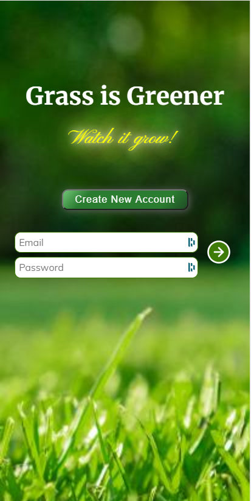
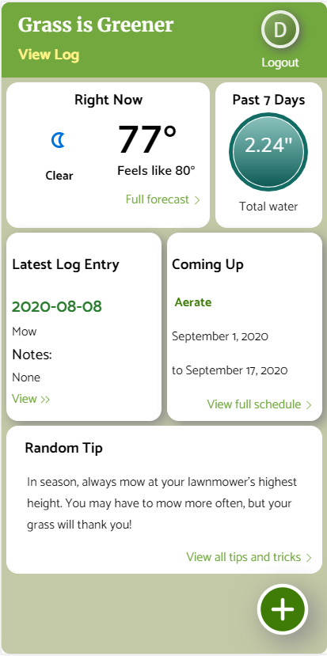
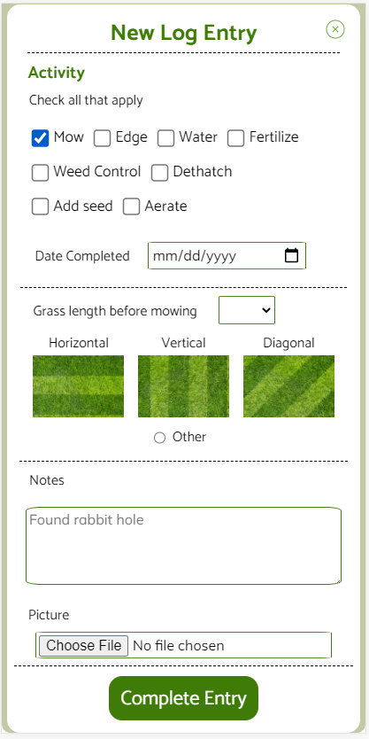
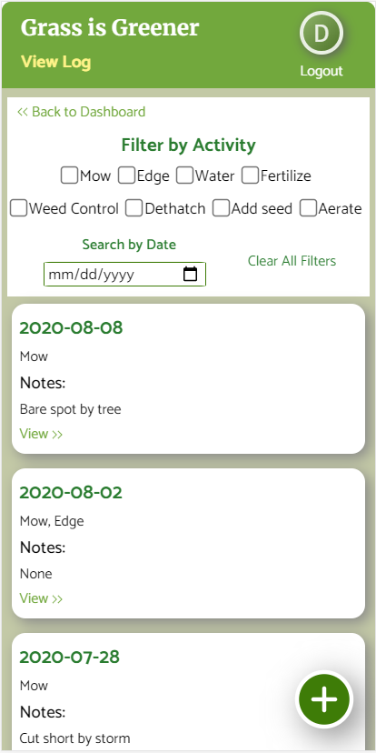
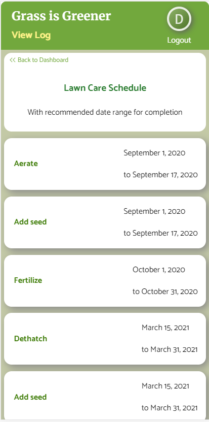

# Grass is Greener
## Helping you grow a greener lawn
by David Larsen

### Overview

BETA

Grass is Greener is designed for personal use for individuals who want to keep better track of their lawn care. It will assist users in not only tracking their lawn care chores as they perform them, but also of helping users know when it is time to complete those tasks. It will also utilize weather API data to remind and alert users of tasks they may not know are needed to maintain a healthy lawn. The integrated weather data will help make this app a “one-stop shop” for lawn hobbyists, providing weather and forecast data to assist with planning lawn care chores.

### Features

- A log which allows users to document their lawn care tasks, as well as other information that may be useful for reference (lawn length, mow direction, water amount, additional notes, picture).
- A full five-day weather forecast, along with current weather and alerts of weather that may impede lawn care or endanger the user
- A precipitation monitoring tool which alerts the user if the amount of water they have received this week is less than an inch
- A schedule of seasonal lawn care tasks such as fertilization, weed control, and overseeding which reminds the user when these tasks are due

### Screenshots







### Installation

1. Use ```git clone``` to clone this repository
2. Within the root of the cloned repo, run ```npm install .``` to install dependencies
3. Within the ```api``` directory, create a database called ```database.json```. A blank example is provided to get you started.
4. Still within the ```api``` directory, type ```json-server-relationship -p 8088 database.json``` and hit enter. This initializes the JSON database.
5. Navigate back to the root and type ```npm start``` to initialize React and launch the app.

### Usage Instructions

#### Registration

1. The first thing you will see is the login screen. Click **Create New Account** to go to the first-time registration.
2. Follow all on-screen instructions to register an account. An accurate zip code will be needed for weather data. However, **do not use any sensitive credentials. This is not a secure application.**
3. At the end of the registration, you will be presented with a confirmation of the information you entered. Click "Finish Registration" to complete registration. You will be taken to the Dashboard.

#### Dashboard

The dashboard will give you a summary of everything you need to know for the day. Here, you will be presented with several blocks of information:
- If there are any alerts, they will be shown at the top of the main window
- Current weather conditions
- A summary of all the precipitation and water your lawn has received for the past seven days
- The most recent log entry
- The next upcoming scheduled task
- A random tip from the database

The dashboard can also be accessed by clicking the _Grass is Greener_ title at the top of the page.

#### Creating a Log Entry

To log a completed lawn care task, follow these instructions:
1. In most sections, you will see a green circle with a white "plus" symbol in the bottom right corner. Click this to create a new log entry.
2. On the New Entry page, check off any tasks you wish to log.
3. Select the date that the tasks were completed.
4. If you selected "mow," additional options will be presented to allow you to select grass length and mow direction.
5. If you selected "water," an additional option will be presented to enter the water amount.
6. Enter any additional notes you wish, and upload a picture. These are optional.
7. Click "Submit Entry" to complete the entry and be taken to the log.

#### The Log

The log is the heart of _Grass is Greener_. It can be accessed from any page by clicking "View Log" near the top left.

- The log will show all entries that have been entered by the user. They can be filtered at the top by the type using the checkboxes, or a specific date can be located as well.
- Clicking on "View" on an individual log entry will take you to the full details of that entry.
- The Detail view also gives you options to edit or delete the entry.

#### Reminders

When you create a new user, _Grass is Greener_ creates a schedule of recommended lawn care tasks for up to a year from the current date. The soonest item is visible on the Dashboard. Clicking on that item will allow you to see the full year's schedule.

When it becomes time to complete a task, a reminder will be presented in the Alerts area of the dashboard. You can also create a new log entry directly from that item in the full schedule. If a task is missed or becomes past due, a warning will be presented, along with an option to remove that item from the list.

#### Weather

In addition to the above, _Grass is Greener_ gives the user weather information to help plan his or her lawn care. The current weather is presented on the dashboard, and clicking that will return a full five-day forecast.

### Planning Tools
[DbDiagram ERD](https://dbdiagram.io/d/5ef25c539ea313663b3af78b)

[Figma Wireframe](https://www.figma.com/file/WtzpVLbQlBpuU4UmZob7Pc/Greener)
